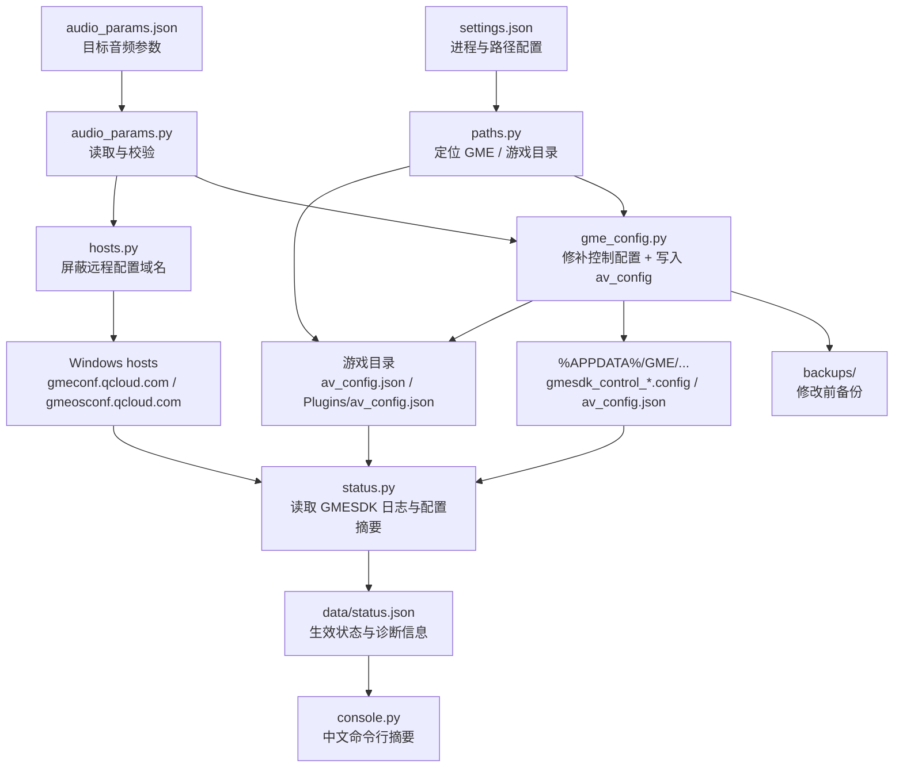

# 免责声明

本项目仅用于个人学习研究、本地配置管理与自有设备上的可恢复性测试，不代表、隶属于、授权自或受米哈游及其关联主体认可。使用本项目即表示你已阅读、理解并同意自行承担全部使用后果；如不同意，请勿下载、运行、传播或基于本项目进行二次开发。

使用者必须遵守中国大陆现行有效的法律法规、部门规章、监管要求及司法解释，包括但不限于网络安全、数据安全、个人信息保护、著作权、计算机信息系统安全保护、反不正当竞争、民事责任、行政责任与刑事责任相关规定；同时必须遵守米哈游游戏的用户协议、游戏规则、社区规范、安全策略、反作弊规则及其后续更新。若本项目说明、功能或使用方式与法律法规或米哈游官方规则存在冲突，应以法律法规和米哈游官方规则为准，并立即停止使用、执行 `restore` 或手动恢复相关配置。

请勿将本项目用于以下场景：

- 绕过、对抗或破坏游戏安全机制、反作弊系统、风控策略、远程配置、运营策略或正常服务秩序；
- 获取不正当优势、影响游戏公平性、干扰其他玩家体验、自动化作弊、外挂、脚本、封包篡改或类似用途；
- 未经授权修改、分发、逆向、复制、抓取或利用米哈游及第三方的客户端、服务端、数据、素材、接口、账号或商业内容；
- 传播违法违规内容、侵犯他人合法权益，或以任何方式规避法律责任、平台规则、账号处罚或安全审查。

本项目会修改本机 hosts、GME 相关配置和可能的游戏目录文件，可能导致语音功能异常、配置无法更新、游戏行为异常、安全软件拦截、账号风险提示、账号限制、封禁、数据丢失或其他不可预期后果。请仅在明确理解影响范围、已备份原始文件、可接受风险且确认不违反官方规则的前提下使用；不再使用时请及时执行 `restore`，必要时从 `backups/` 手动恢复。

本仓库及其代码、文档、发行物、Issue、讨论区和相关页面可能因合规、版权、平台规则、维护成本或其他原因随时删除、归档、私有化、迁移或停止更新，作者不承诺持续维护、可用性、兼容性、技术支持或历史版本保留。请勿将本仓库作为长期可用来源或唯一备份来源。

# 交流QQ群：111399948 （偏日常生活向，可从此途径联系作者）

<div align="center">
<br />

# 🎙️ MiliastraGME

**面向 GME 语音链路的本地参数助手：为虚拟麦克风、音乐输入与语音场景写入高音质配置，改善玩家体验。**

> 让 GME 语音参数不再被默认降噪、自动增益和远程配置反复覆盖；写入、备份、锁定、验证、恢复，一条命令完成。


[](https://github.com/clearyss/MiliastraGME/blob/main/LICENSE)
[](https://github.com/clearyss/MiliastraGME/stargazers)
[](https://github.com/clearyss/MiliastraGME/network)
[](https://github.com/clearyss/MiliastraGME/issues)
[](https://github.com/clearyss/MiliastraGME/pulls)

</div>

---

## 项目简介

MiliastraGME 是一个 Windows 本地命令行工具，用于把 `audio_params.json` 中定义的目标语音参数写入 GME SDK 相关配置，并解析运行时日志确认游戏是否真正使用了这些参数。

当前默认方案面向 **虚拟麦克风 / 本机音乐输入**：

- `48 kHz` 采样率
- `双声道`
- `128 kbps` 码率
- 关闭 `AEC`、`AGC`、`ANS`、`AINS`、`VAD`
- 保留 `FEC` 丢包保护
- 设置更宽松的 jitter 缓冲

> [!IMPORTANT]
> `inject` 和 `restore` 会写入系统 hosts、GME 配置目录和可能的游戏目录，必须使用管理员 PowerShell 运行。工具会在修改前把已有文件备份到本项目的 `backups/`，但 `restore` 当前只移除 hosts 屏蔽段和本工具写入的 `av_config.json`，不会自动把已改写的 `gmesdk_control_*.config` 回滚到备份版本；如需完全回退，请从 `backups/` 手动恢复对应文件。


<table>
  <thead>
    <tr>
      <th align="center">Patch</th>
      <th align="center">Lock</th>
      <th align="center">Verify</th>
    </tr>
  </thead>
  <tr>
    <td width="33%">
      <strong>🛠️ 参数写入</strong><br />
      <sub>修补 GME 控制配置，生成本地 <code>av_config.json</code>，并统一目标音频参数。</sub>
    </td>
    <td width="33%">
      <strong>🧱 远程锁定</strong><br />
      <sub>在 hosts 中屏蔽 GME 远程配置域名，减少远程策略覆盖本地参数。</sub>
    </td>
    <td width="33%">
      <strong>🔍 日志验证</strong><br />
      <sub>解析 <code>GMESDK_*.log</code> 中的实际运行时参数，判断配置是否真正生效。</sub>
    </td>
  </tr>
</table>

## 核心能力

<table>
  <tr>
    <td align="center"><kbd>params</kbd></td>
    <td align="center">→</td>
    <td align="center"><kbd>inject</kbd></td>
    <td align="center">→</td>
    <td align="center"><kbd>status</kbd></td>
    <td align="center">→</td>
    <td align="center"><kbd>restore</kbd></td>
  </tr>
  <tr>
    <td align="center"><sub>查看方案</sub></td>
    <td></td>
    <td align="center"><sub>写入配置</sub></td>
    <td></td>
    <td align="center"><sub>验证生效</sub></td>
    <td></td>
    <td align="center"><sub>移除注入</sub></td>
  </tr>
</table>

## 架构



## 快速开始

<table>
  <tr>
    <td align="center"><strong>① Clone</strong><br /><sub>拉取源码</sub></td>
    <td align="center">→</td>
    <td align="center"><strong>② Configure</strong><br /><sub>确认参数与路径</sub></td>
    <td align="center">→</td>
    <td align="center"><strong>③ Inject</strong><br /><sub>管理员写入</sub></td>
    <td align="center">→</td>
    <td align="center"><strong>④ Verify</strong><br /><sub>进入语音场景后验证</sub></td>
    <td align="center">→</td>
    <td align="center"><strong>⑤ Restore</strong><br /><sub>按需清理</sub></td>
  </tr>
</table>

### 环境要求

<table>
  <tr>
    <td><strong>系统</strong></td>
    <td><code>Windows</code></td>
    <td><sub>依赖 Windows hosts、PowerShell、CIM 进程查询和 <code>%APPDATA%</code> 路径。</sub></td>
  </tr>
  <tr>
    <td><strong>Python</strong></td>
    <td><code>3.10+</code></td>
    <td><sub>仅使用 Python 标准库，无第三方依赖。</sub></td>
  </tr>
  <tr>
    <td><strong>权限</strong></td>
    <td><code>管理员</code></td>
    <td><sub><code>inject</code> / <code>restore</code> 需要写 hosts 与游戏配置。</sub></td>
  </tr>
  <tr>
    <td><strong>目标</strong></td>
    <td><code>GME SDK</code></td>
    <td><sub>默认进程名为 <code>YuanShen.exe</code>，可在 <code>settings.json</code> 中修改。</sub></td>
  </tr>
</table>

### 1. 克隆

```powershell
git clone https://github.com/clearyss/MiliastraGME.git
cd MiliastraGME
python --version
```

### 2. 查看当前方案

```powershell
python __main__.py params
```

示例输出：

```text
当前方案
==================================
方案：虚拟麦克风音乐参数
用途：面向本机音乐/虚拟声卡输入，关闭全部语音处理
音质：48 kHz / 双声道 / 128 kbps
处理：回声消除关、自动音量关、普通降噪关、AI 降噪关、静音检测关、丢包保护开
网络缓冲：初始 1000 ms，范围 1200-2000 ms
```

### 3. 调整参数

编辑 `audio_params.json`：

```json
{
  "name": "虚拟麦克风音乐参数",
  "description": "面向本机音乐/虚拟声卡输入，关闭全部语音处理",
  "audio": {
    "aec": 0,
    "agc": 0,
    "ans": 0,
    "ains": 0,
    "vad": 0,
    "fec": 1,
    "frame": 40,
    "sample_rate": 48000,
    "channel": 2,
    "codec_prof": 4129,
    "kbps": 128,
    "bitrate": 128000,
    "jitter_init": 1000,
    "jitter_min": 1200,
    "jitter_max": 2000
  }
}
```

常用字段说明：

| 字段 | 含义 | 默认值 |
| --- | --- | ---: |
| `aec` | 回声消除 | `0` |
| `agc` | 自动增益 | `0` |
| `ans` | 普通降噪 | `0` |
| `ains` | AI 降噪 | `0` |
| `vad` | 静音检测 | `0` |
| `fec` | 丢包保护 | `1` |
| `sample_rate` | 采样率 | `48000` |
| `channel` | 声道数 | `2` |
| `kbps` / `bitrate` | 码率 | `128` / `128000` |
| `jitter_init` / `jitter_min` / `jitter_max` | 网络缓冲参数 | `1000` / `1200` / `2000` |

### 4. 调整路径

编辑 `settings.json`：

```json
{
  "process_name": "YuanShen.exe",
  "module_name": "gmesdk.dll",
  "gme_dir": "",
  "game_dir": ""
}
```

| 字段 | 说明 |
| --- | --- |
| `process_name` | 目标进程名；默认用于定位 `%APPDATA%\GME\<process_name>`，并在未配置 `game_dir` 时尝试从运行进程检测游戏目录。 |
| `module_name` | GME 模块名，当前作为配置项保留。 |
| `gme_dir` | 手动指定 GME 数据目录；留空时使用 `%APPDATA%\GME\<process_name>`。 |
| `game_dir` | 手动指定游戏目录；留空时尝试从正在运行的 `process_name` 获取。 |

如果游戏没有运行且 `game_dir` 留空，工具仍会写入 GME 数据目录下的 `av_config.json`，但不会写入游戏安装目录下的 `av_config.json`。

### 5. 写入配置

以管理员身份打开 PowerShell，然后运行：

```powershell
python __main__.py inject
```

不带子命令时也会默认执行 `inject`：

```powershell
python __main__.py
```

`inject` 会执行：

1. 校验 `audio_params.json`
2. 修补 `%APPDATA%\GME\<process_name>\gmesdk_control_*.config`
3. 写入 GME 数据目录和可检测游戏目录中的 `av_config.json`
4. 在 Windows hosts 中加入 GME 远程配置域名屏蔽段
5. 刷新 DNS
6. 写入 `data/gme_voice_auto_injector_manifest.json`
7. 读取配置与日志并输出状态摘要

### 6. 验证是否生效

进入一次游戏语音场景，让 GME 产生新的运行时日志后执行：

```powershell
python __main__.py status
```

成功时会看到类似：

```text
当前状态
==================================
状态：已生效
说明：游戏当前使用的语音参数已是目标方案。
游戏记录：游戏已使用当前方案
游戏当前音质：48 kHz / 双声道 / 128 kbps
维护状态：联网配置已锁定；本地配置已写入
```

### 7. 清理注入项

以管理员身份运行：

```powershell
python __main__.py restore
```

`restore` 会移除：

- hosts 中由本工具写入的屏蔽段
- 本工具目标路径中的 `av_config.json`

如需恢复被修补过的 `gmesdk_control_*.config`，请从 `backups/` 中选择对应备份文件手动覆盖回原路径。

## 命令手册

| 命令 | 需要管理员 | 说明 |
| --- | :---: | --- |
| `python __main__.py params` | 否 | 显示当前目标音频方案、参数文件、设置文件、GME 目录和游戏目录。 |
| `python __main__.py inject` | 是 | 应用一次参数：修补 GME 控制配置、写入本地 `av_config.json`、安装 hosts 屏蔽段并生成状态文件。 |
| `python __main__.py status` | 否 | 读取 GME 配置、hosts 和最新运行日志，判断参数是否生效。 |
| `python __main__.py restore` | 是 | 移除 hosts 屏蔽段和本工具写入的本地 `av_config.json`。 |
| `python __main__.py` | 是 | 等价于 `python __main__.py inject`。 |

如果你从项目父目录执行，也可以使用模块形式：

```powershell
python -m MiliastraGME params
python -m MiliastraGME inject
python -m MiliastraGME status
python -m MiliastraGME restore
```

## 输出资产

```text
MiliastraGME/
  ├─ audio_params.json
  ├─ settings.json
  ├─ data/
  │  ├─ gme_voice_auto_injector_manifest.json
  │  └─ gme_voice_auto_injector_status.json
  └─ backups/
     ├─ hosts.hosts.<timestamp>.bak
     ├─ gmesdk_control_*.config.control.<timestamp>.bak
     └─ av_config.json.av_config.<timestamp>.bak
```

| 路径 | 内容 |
| --- | --- |
| `audio_params.json` | 目标音频参数与方案描述。 |
| `settings.json` | 进程名、GME 数据目录和游戏目录配置。 |
| `data/gme_voice_auto_injector_manifest.json` | 最近一次 `inject` 的完整执行记录。 |
| `data/gme_voice_auto_injector_status.json` | 最近一次 `status` / `inject` 生成的生效状态。 |
| `backups/` | 修改前备份，包含 hosts、GME 控制配置和被覆盖的 `av_config.json`。 |

可能被写入的外部路径包括 `%APPDATA%\GME\<process_name>\gmesdk_control_*.config`、`%APPDATA%\GME\<process_name>\av_config.json`、`<game_dir>\av_config.json`、`<game_dir>\YuanShen_Data\Plugins\av_config.json` 和 `%SystemRoot%\System32\drivers\etc\hosts`。

## 代码地图

<details open>
<summary><strong>核心模块</strong></summary>

| 文件 | 角色 |
| --- | --- |
| `__main__.py` | CLI 入口，注册 `inject`、`status`、`params`、`restore` 子命令。 |
| `audio_params.py` | 读取、校验、格式化 `audio_params.json`，维护运行时目标参数。 |
| `gme_config.py` | 解码 / 编码 GME 控制配置，修补音频参数，写入本地 `av_config.json`。 |
| `status.py` | 解析 GME 日志和配置摘要，判断运行时参数是否匹配目标方案。 |
| `console.py` | 中文命令行输出、参数摘要、诊断信息和下一步建议。 |

</details>

<details>
<summary><strong>路径、备份与系统集成</strong></summary>

| 文件 | 角色 |
| --- | --- |
| `paths.py` | 加载 `settings.json`，定位 `%APPDATA%`、GME 数据目录和游戏目录。 |
| `hosts.py` | 安装 / 移除 hosts 屏蔽段，刷新 DNS，检查远程配置域名锁定状态。 |
| `common.py` | 管理目录、管理员权限检测、JSON 写入和备份文件生成。 |
| `constants.py` | 项目路径、hosts 标记、远程配置域名、默认状态文件路径。 |

</details>

## 状态判定逻辑

`status` 会找到最新 `GMESDK_*.log`，提取 `PrepareEncParam|AudParam` / `SetAudParam`，再结合配置文件修改时间判断日志是否新鲜。它会比较 `AEC`、`AGC`、`ANS`、`AINS`、`VAD`、`FEC`、`Frame`、`SR`、`CH`、`Codec`、`BR` 和 jitter 参数，并输出：

- `matched`：最新运行时日志已匹配目标参数。
- `matched_config_current`：最近记录匹配，且本地配置也匹配目标参数。
- `not_matched`：日志有效，但运行时仍使用旧参数。
- `stale_matched` / `stale_not_matched`：日志早于本次配置修改，需要进入语音场景刷新。
- `no_sample` / `no_log`：缺少可验证的语音参数记录或 GME 日志。

## hosts 屏蔽段

工具会写入以下标记包围的 hosts 段：

```text
# BEGIN GME_VOICE_AUTO_INJECTOR
0.0.0.0 gmeconf.qcloud.com
::1 gmeconf.qcloud.com
0.0.0.0 gmeosconf.qcloud.com
::1 gmeosconf.qcloud.com
# END GME_VOICE_AUTO_INJECTOR
```

重复执行 `inject` 会先移除旧标记段再重新写入，避免重复追加。`restore` 会删除这个标记段，并兼容清理旧版本标记：

```text
# BEGIN GME_REMOTE_CONTROL_CONFIG_BLOCK
# END GME_REMOTE_CONTROL_CONFIG_BLOCK
```

## 故障排查

| 现象 | 可能原因 | 处理 |
| --- | --- | --- |
| `需要管理员权限` | 当前 PowerShell 不是管理员 | 右键 PowerShell，选择“以管理员身份运行”。 |
| `未找到参数文件` | 缺少 `audio_params.json` | 确认文件位于项目根目录，且 JSON 为 UTF-8。 |
| `audio_params.json 缺少参数` | 目标参数字段不完整 | 参考默认 `audio_params.json` 补齐所有字段。 |
| `bitrate 不应小于 kbps * 1000` | `kbps` 与 `bitrate` 不一致 | 例如 `kbps=128` 时 `bitrate` 至少为 `128000`。 |
| `游戏目录：未设置，当前也未检测到正在运行的游戏` | `game_dir` 留空且目标进程未运行 | 启动游戏后再执行，或在 `settings.json` 中手动填入 `game_dir`。 |
| `游戏还未切换到当前方案` | 游戏仍使用旧日志或远程 / 运行时配置覆盖 | 重新执行 `inject`，进入一次语音场景，再运行 `status`。 |
| `最近记录早于本次修改` | 日志时间早于配置修改时间 | 进入语音场景刷新 GME 日志。 |
| `联网配置未锁定` | hosts 写入失败或被其他软件改回 | 以管理员重新执行 `inject`，检查安全软件或网络代理。 |
| `restore` 后仍看到控制配置被修改 | `restore` 不自动回滚 `gmesdk_control_*.config` | 从 `backups/` 手动恢复对应 `.bak` 文件。 |

## 注意事项

- `data/` 和 `backups/` 可能包含本机路径、GME 日志片段和配置摘要，公开仓库提交前建议先清理。
- 修改 hosts 可能影响 GME 远程配置获取；如不再使用本工具，请运行 `restore`。
- 修改后的 GME 控制配置会被设为只读，以减少运行时覆盖；如需手动编辑，请先取消只读属性。
- 目标参数是否产生理想效果仍取决于游戏版本、GME SDK 版本、输入设备、虚拟声卡和系统音频设置。

<a id="contributing"></a>

## 🤝 参与贡献

欢迎参与项目贡献！你可以：

- 提交 [Bug 报告](https://github.com/clearyss/MiliastraGME/issues/new?template=bug_report.md)
- 提出 [新功能建议](https://github.com/clearyss/MiliastraGME/issues/new?template=feature_request.md)
- 改进 [文档](https://github.com/clearyss/MiliastraGME/wiki)
- 提交 [Pull Request](https://github.com/clearyss/MiliastraGME/pulls)

<a id="community"></a>

## 💬 交流反馈

- 问题反馈：[GitHub Issues](https://github.com/clearyss/MiliastraGME/issues)
- QQ 交流群：`111399948`

<a id="license"></a>

## 📄 许可证

本项目采用 [GPL-3.0](LICENSE) 许可证。

---

<div align="center">
  <h3>Star History</h3>

  <a href="https://star-history.com/#clearyss/MiliastraGME&Date">
    
  </a>

  <p>Made with ❤️ by <a href="https://github.com/clearyss">clearyss</a></p>
</div>
